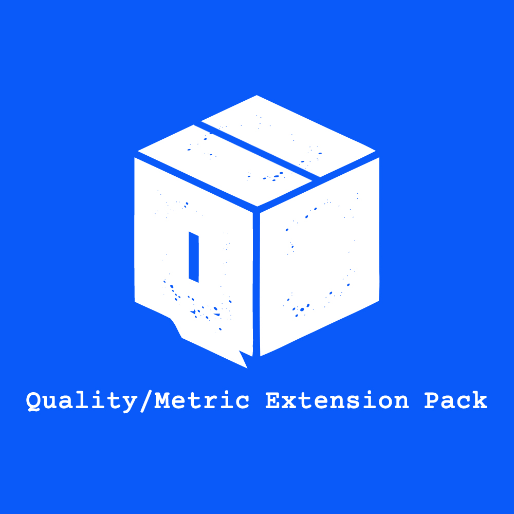

<a href="https://marketplace.visualstudio.com/items?itemName=SeyyedKhandon.qpack">
  
</a>

# Quality/Metric Extension Pack (QPack)

### QPack

Web Quality/Metric Development Essentials Extension Pack for Visual Studio Code

### Available Commands

- `Activate Quality/Metric Extension Pack (QPack) Config`
- `Deactivate Quality/Metric Extension Pack (QPack) Config`

**Note:** to run commands, press `ctrl+shift+p` to open the command palette, and then type the command .e.g. `activate qpack` then select it.

<details>
<summary>
<i>Here are the configurations this plugin will set for you</i>
</summary>

```json
{
  "eslint.alwaysShowStatus": true,
  "eslint.lintTask.enable": true,
  "eslint.codeAction.showDocumentation": {
    "enable": true
  },
  "codemetrics.nodeconfiguration.ReturnStatement": 0.1,
  "codemetrics.nodeconfiguration.SwitchStatement": 0.1,
  "codemetrics.nodeconfiguration.JsxSelfClosingElement": 0.1,
  "codemetrics.nodeconfiguration.JsxElement": 0.2,
  "codemetrics.basics.CodeLensHiddenUnder": 4,
  "sonarlint.disableTelemetry": true
}
```

</details>

## Extensions Included

- 1- [ESLint](https://marketplace.visualstudio.com/items?itemName=dbaeumer.vscode-eslint) - Integrates ESLint JavaScript into VS Code.

- 2- [CodeMetrics](https://marketplace.visualstudio.com/items?itemName=kisstkondoros.vscode-codemetrics) - Computes complexity in TypeScript / JavaScript files.

- 3- [SonarLint](https://marketplace.visualstudio.com/items?itemName=SonarSource.sonarlint-vscode) - SonarLint is an IDE extension that helps you detect and fix quality issues as you write code in JavaScript, TypeScript, Python, Java, HTML and PHP.

- 4- [Code Spell Checker](https://marketplace.visualstudio.com/items?itemName=streetsidesoftware.code-spell-checker) - Spelling checker for source code


**Notes**:

- To enable `Sonar lint`, you have to install `java runtime environment(jre)`, which it will ask to download it when it has been installed.

- You can use [Tech Debt Metrics](https://marketplace.visualstudio.com/items?itemName=Stepsize.tech-debt-tracker) as a complement to `CodeMetrics` metric checker(But it is too heavy!).

## Recommended Extension pack

<a href="https://marketplace.visualstudio.com/items?itemName=SeyyedKhandon.zpack">
  
</a>

[ZPack](https://marketplace.visualstudio.com/items?itemName=SeyyedKhandon.zpack) is An Opinionated collection of the `best` and `most` used extensions for Web Developers in VSCode which has Better `Developer Experience(DX)` and `load time` in Mind.

## Relevant Links

- [Github](https://github.com/SeyyedKhandon/qpack)
- [VS Code Marketplace](https://marketplace.visualstudio.com/items?itemName=SeyyedKhandon.qpack)

**Enjoy!**
